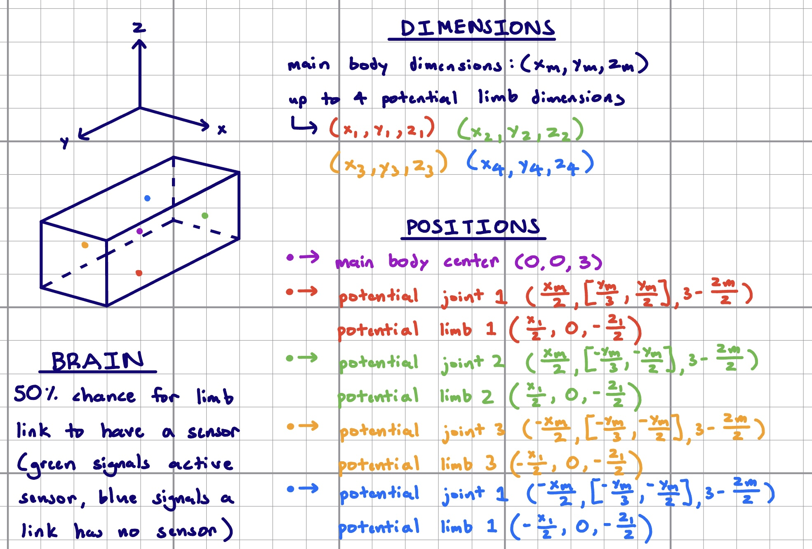

# CS396 - Assignment 8
**Synopsis**

This codebase was created for the CS396 course at Northwestern University. It generates a desired number of random 3D creatures and displays the most fit creature after running. Fitness is described as how far in the positive x-direction a creature moves. Most of the code was created by following Ludobots, an online course found at https://www.reddit.com/r/ludobots/. Ludobots makes use of the PyroSim modeling interfacethe repository can be found at https://github.com/jbongard/pyrosim.git.

**Instructions**

Simply run the "search.py" file to run the simulation and see an optimized 3D creature appear! The 3D creature shown is the most fit from a population size of 10 and 100 number of generations.

**Video**

https://www.youtube.com/watch?v=paAGQGJgr74

**Diagram**

**Fitness Curves**

**Body & Brain Generation Explanation**

To create a 3D creature, the code starts by defining a main link that serves as the torso. This torso is centered at (0, 0, 3), with the 3 units in the z-axis being added to account for the creature potentially dipping into negative z-space. The torso is generated with a random size with bounds for dimensions so that it is neither too large or too small.

After the torso is created, the code determines how many limb links are to be made. This is decided randomly, and a creature can have anywhere from one to nine links. Once the number of limb links are decided, the code creates joints at random locations along the sides and faces of the torso within specific parameters (see diagram for specific ranges). The links are then positioned relative to the joints (see diagram) and the physical creature construction is complete.

Sensor placement is determined by 50% probability. All of the links are compiled into a dictionary and the code iterates through each link to determine whether or not it will have a sensor. If so, the code turns the color of the link green. If not, the link is colored blue.

**Evolution & Mutation Function Explanation**

As mentioned in the synopsis, the fitness of a creature is essentially how far it moves in the positive x-direction. Creatures start out by randomly wiggling around in their environment and as such have a low fitness value. Over the course of 100 generations, the mutation function alters both the brain and body of the creatures in an attempt to improve their fitness.

The mutation function has a 100% probability of altering the weight of a random synapse. It does so by choosing a random synapse weight and altering it to random.random()*2-1. It has a 50% probability of altering the size of a random link. It does so by randomly choosing between 0 and 1. If 0 is chosen, no link is altered. If 1 is chosen, a random link is chosen from the dictionary containing every link and its size is regenerated with specific parameters (see diagram).
