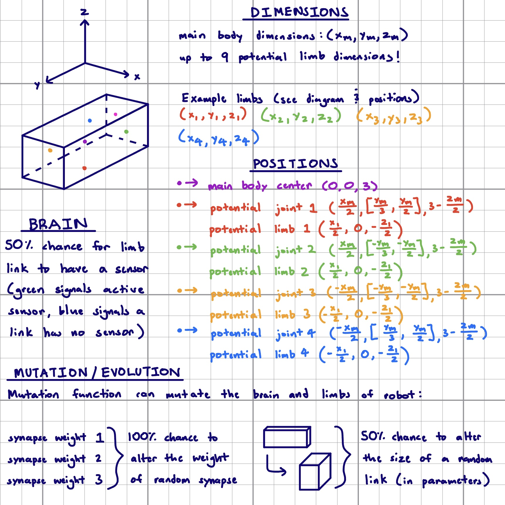

# CS396 - Final Project (Artist)
**Synopsis**

This codebase was created for the CS396 course at Northwestern University. It generates a desired number of random 3D robots and displays the most fit robot after running. Fitness is described as how far in the positive x-direction a robot moves. Most of the code was created by following Ludobots, an online course found at https://www.reddit.com/r/ludobots/. Ludobots makes use of the PyroSim modeling interface - the repository can be found at https://github.com/jbongard/pyrosim.git.

**Instructions**

Simply run the "search.py" file to run the simulation and see an optimized 3D robot appear! 

The 3D robot shown is the most fit from a population size of 10 and 100 number of generations. You can alter the population size and generation constants by changing the populationSize and numberOfGenerations variables in constants.py. To see the data of the most fit robot, open the file in the directory called "fitness*.txt", where * represents the generation number the robot was a part of.

**Teaser**

WIP

**Summary Video**

WIP

**General Diagram**

**Genotype-to-Phenotype Map**

WIP

**Mutation and Selection Diagram**

WIP

**Fitness Curves**

**Body & Brain Generation Explanation**

To create a 3D robot, the code starts by defining a main link that serves as the torso. This torso is centered at (0, 0, 3), with the 3 units in the z-axis being added to account for the robot potentially dipping into negative z-space. The torso is generated with a random size with bounds for dimensions so that it is neither too large or too small.

After the torso is created, the code determines how many limb links are to be made. This is decided randomly, and a robot can have anywhere from one to nine links. Once the number of limb links are decided, the code creates joints at random locations along the sides and faces of the torso within specific parameters (see diagram for specific ranges). The links are then positioned relative to the joints (see diagram) and the physical robot construction is complete.

Sensor placement is determined by 50% probability. All of the links are compiled into a dictionary and the code iterates through each link to determine whether or not it will have a sensor. If so, the code turns the color of the link green. If not, the link is colored blue.

Motor placement is determined by 50% probability. All of the links are compiled into a dictionary and the code iterates through each link to determine whether or not it will have a motor. It is possible for a link to have a sensor attached to it but not a motor, and vice versa.

**Evolution & Mutation Function Explanation**

As mentioned in the synopsis, the fitness of a robot is determined by how far it moves in the positive x-direction. Robots start out by randomly wiggling around in their environment and as such produce a low fitness value. Over the course of 100 generations, the mutation function alters both the brain and body of the robots in an attempt to improve their fitness.

The mutation function has a 100% probability of altering the weight of a random synapse. It does so by choosing a random synapse weight and altering it to random.random()*2-1. It has a 50% probability of altering the size of a random link. It does so by randomly choosing between 0 and 1. If 0 is chosen, no link is altered. If 1 is chosen, a random link is chosen from the dictionary containing every link and its size is regenerated with specific parameters (see diagram).

**Results & Discussion**

Overall, it appears that positive evolution does indeed occur when utilizing the mutation function. The fitness curve picture shows that each of the five seeds experienced some sort of positive fitness growth as successive generations of robots were generated. Through observation of initial, random robots and fit, successively generated robots, I observed a few general patterns in terms of how bodies, brains, and behaviors changed.

Bodies initially start out with a random amount of links that all have random sizes. Successful robots usually had 4 links protruding downwards that acted as legs, with each link being roughly the same size as the others. Unsucessful robots either did not have enough leg links or had leg link sizes that were too large, resulting in an inability to walk in the positive x-direction.

Brains initially start out with motorized links randomly flailing around. Successful robots usually had motorized leg links that worked in tandem to propel the robot forward. This means they usually followed a rhythm of movement that is common in lots of quadriped animals such as horses or cows. Unsuccesful robots either had motorized legs that worked against each other or did not display much movement.

Robot behavior usually started out with the robot wiggling in place without much coordinated movement. Successful robots displayed a sense of urgency with their behavior as they steadily crawled towards the positive x-direction. Unsuccesful robots either did not move in the positive x-direction or remained around their spawned location.
